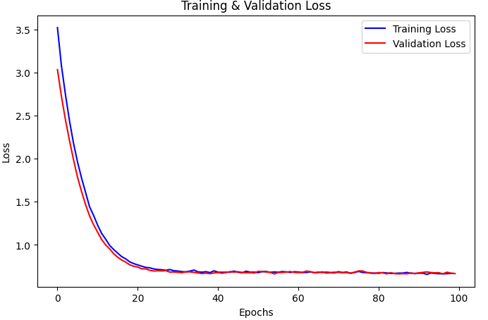

# **Custom Model Creation Project**

## **Project Description**
This project demonstrates how to build custom machine learning models using the **Keras** and **TensorFlow** libraries. The primary focus is on creating robust and accurate binary classification models. The dataset used is the **Water Potability Dataset**, and the goal is to predict whether the water is potable (safe for human consumption) based on multiple key parameters.

---

## **Table of Contents**
1. [Dataset](#dataset)
2. [Technologies Used](#technologies-used)
3. [Project Workflow](#project-workflow)
4. [Custom Models](#custom-models)
   - Jordan Nguepi's Model
   - Jamillah Ssozi's Model
   - Anissa's Model
5. [Visualizations](#visualizations)
6. [Results](#results)
7. [Conclusion](#conclusion)

---

## **Dataset**
The **Water Potability Dataset** was used in this project. This dataset contains a collection of water quality measurements along with a target variable called `Potability`, indicating if the water is suitable for drinking.

- **Task**: Predict `Potability` (binary classification: 1 for drinkable & 0 for non-drinkable).
- **Key Features**:
  - PH
  - Hardness
  - Solids
  - Chloramines
  - Sulfate
  - ... etc.

### **Dataset Source**:  
[Water Quality and Potability - Kaggle](https://www.kaggle.com/datasets/uom190346a/water-quality-and-potability?select=water_potability.csv)

---

## **Technologies Used**
- **Language**: Python 3.x
- **Libraries**:
  - TensorFlow and Keras
  - NumPy and Pandas
  - Scikit-learn
  - Matplotlib and Seaborn

---

## **Project Workflow**

1. **Dataset Loading and Preprocessing**
   - Downloaded the water potability dataset.
   - Missing data imputed using the mean of the columns.
   - Dataset split into training, validation, and testing datasets.
   - Features standardized using `StandardScaler`.

    *(TODO will add image later)*

2. **Model Building**
   - Each team member contributes their own custom model design.
   - Model structures vary based on:
     - Choice of layers.
     - Regularization techniques (e.g., Dropout, L2).
     - Optimization strategies (Adam, RMSProp, etc.).

3. **Model Training**
   - Each model was trained using the **binary cross-entropy loss function**.
   - Early stopping was employed to avoid overfitting.

4. **Evaluation**
   - Generated metrics such as accuracy, precision, recall, and F1 score.
   - Visualized loss and accuracy over epochs for better insights.

---

## **Custom Models**
### **Jordan Nguepi's Model**
This model incorporates advanced regularization techniques like **Dropout**, **Batch Normalization**, and **L2 Regularization** to ensure robustness.

**Key Details**:
- Layers: 4 Hidden Layers
- Activation Functions: ReLU for hidden layers, Sigmoid for the output layer.
- Optimizer: **Adam**.

 *(TODO will add image later)*




---

### **Jamillah Ssozi's Model**
This model opts for multiple hidden layers with **Dropouts** and **Batch Normalization**. It uses the RMSProp optimizer and focuses on balancing the learning rate to reduce overfitting.

**Key Details**:
- Layers: 6 Hidden Layers
- Activation Functions: ReLU for hidden layers, Sigmoid for output.
- Optimizer: **RMSProp**.

 *(Add you image Jamillah, take screenshotes and add it in the image directory)*

 


### **Anissa's Model**
This model uses L2 regularization with two hidden layers to improve accuracy and robustness.

Key Details:

Layers: 3 Hidden Layers
Activation Functions: ReLU for hidden layers, Sigmoid for output.
Optimizer: Stochastic Gradient Descent (SGD).
---

### **Additional Models**
For team-based collaboration, you can add more models under this section.

---

## **Visualizations**
A variety of visualizations help evaluate model performance across different metrics.

1. **Training & Validation Accuracy**  
   
   
2. **Training & Validation Loss**  
   
   


---

## **Results**
- *(TODO evaluate and add both the test and train accuracy of you models)*:

**Metrics for Models**:
- **Jordan Nguepi's Model**:
  - Train Accuracy: 69%
  - Test Accuracy: 68%
- **Jamillah Ssozi's Model**:
  - Train Accuracy: 69.1%
  - Test Accuracy: 68.3%
- **Anissa's Model**: 
  - Train Accuracy: 66%
  - Test Accuracy: 71%


---

## **Conclusion**
- **Model Performance**:
  - Jordan's model with [Adam optimizer] showed slightly better generalization but required significant early stopping.
  - Jamillah's model emphasized regularization and performed better in terms of validation dataset metrics.


**Future Work Suggestions**:
- Hyperparameter tuning for more efficiency.
- Experimenting with ensemble methods or other advanced techniques.

---

## **How to Run the Project**
1. Clone this repository to your local system:
   ```bash
    git clone https://github.com/danjor667/formative_II_water_quality.git
   cd formative_II_water_quality
   ```
2. Install dependencies:
   ```bash
   pip install -r requirements.txt
   ```
3. Place the **water_potability.csv** dataset in the project directory.
4. Run the Jupyter notebook:
   ```bash
   jupyter notebook formative_II_custom_model.ipynb
   ```
5. Follow the cells sequentially for preprocessing, model training, and evaluation.

---

## **Contributors**
- **Jordan Nguepi**: Model Developer
- **Jamillah Ssozi**: Model Developer
- **Anissa OUEDRAOGO**: Model Developer

---
